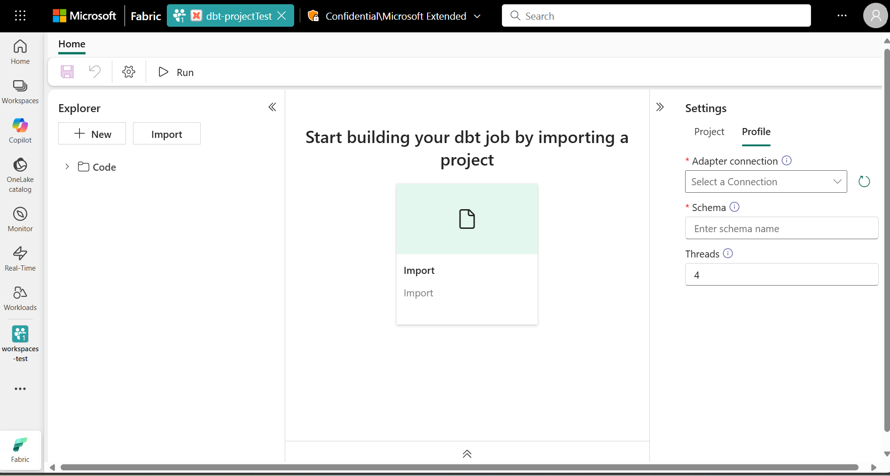
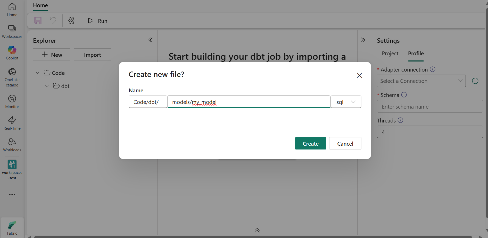
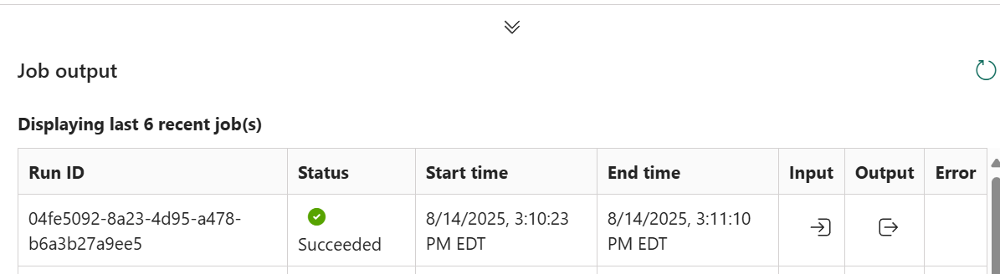

# 🛠️ Getting Started with Microsoft Fabric and dbt: Build a Sample Warehouse and Transform Data Natively

Microsoft Fabric now lets you build and transform data pipelines using **dbt**—all within the Fabric web experience. No external adapters, no CLI, no Airflow. Just SQL, a warehouse, and a streamlined UI.

This walkthrough demonstrates how to use dbt directly within Microsoft Fabric to transform data in a warehouse—without external tools. It’s designed to help data engineers and analysts:
- Creating a sample Data Warehouse in Fabric
- Building a dbt item to transform your data
- Running and validating your models—all natively in Fabric

---

## ✅ Prerequisites
Before you begin, make sure you have:
- Access to a Microsoft Fabric workspace
- Contributor permissions in the workspace


---

## 🧱 Step 1: Create a Sample Data Warehouse
1. In your Fabric workspace, click `New` then select `Sample Warehouse`.
2. Name your warehouse (e.g., `warehouse-test`). Sample data will be created, which we’ll transform using dbt.


---

## 📦 Step 2: Create a dbt Item
1. Click `New Item`, then select `dbt job(preview)`.
2. Name your project (e.g., `dbt-project`) and select the warehouse you just created.
3. You’ll see the dbt interface with:
   - `Explorer (Left)`: Manage files and folders
   - `Main Panel (Center)`: Start building or import a dbt project
   - `Settings (Right)`: Configure schema and thread count


---

## Step 3: Build Your dbt Project

##### 1. Add Required Folders and Files
When you create a new dbt item in Fabric, it only gives you a blank canvas. You’ll need to manually add the following:

```
dbt/
├── models/
│   └── my_model.sql
├── schema.yml
├── dbt_project.yml
```
Click `New` in the `Explorer` to create new files and folders

   - `models/`: Folder to store your SQL models.
   - `my_model.sql`: A sample transformation query.
   - `schema.yml`: Defines tests and documentation for your models.
   - `dbt_project.yml`: Core configuration file for your dbt project.

##### 2. Populate Files
`dbt_project.yml` defines your project’s structure and execution settings.
```
name: 'fabric_demo'
version: '1.0'
profile: 'fabric'
model-paths: ['models']
```

`schema.yml` Defines metadata and validation rules.
```
version: 2

models:
  - name: my_model
    description: "A simple model for demo purposes"
    columns:
      - name: id
        description: "Unique identifier"
        tests:
          - not_null
          - unique
```
`models\mymodel.sql` A basic transformation query that transforms some data found in the sample warehouse we created earlier.
```
SELECT
  DateID,
  Date,
  DateBKey
FROM
  Date
```

---

## ⚙️ Step 4: Configure and Run
- In the Settings panel:
  - Select your warehouse connection `warehouse-test`
  - Set your schema name (e.g `dbo`)
  - Adjust thread count (default: 4)
- Click `Run` to execute your models
   - If the run fails, check the Job output panel for error messages and verify your SQL syntax and warehouse connection.
- Validate Transoformations
   - View input, ouput, and potential errors directly in the UI in the `Job output` panel


---

## Why This Matters
- Native Integration: dbt runs directly in Fabric—no CLI, adapters, or orchestration layers needed.
- Declarative SQL Modeling: You define transformations using SQL, and dbt handles dependencies and execution order.
- Visual lineage and Git integration
- Lineage Visualization: Fabric shows how data flows from source to model, helping with debugging and auditing. 
